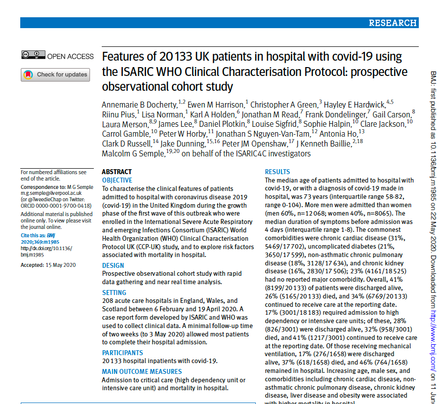
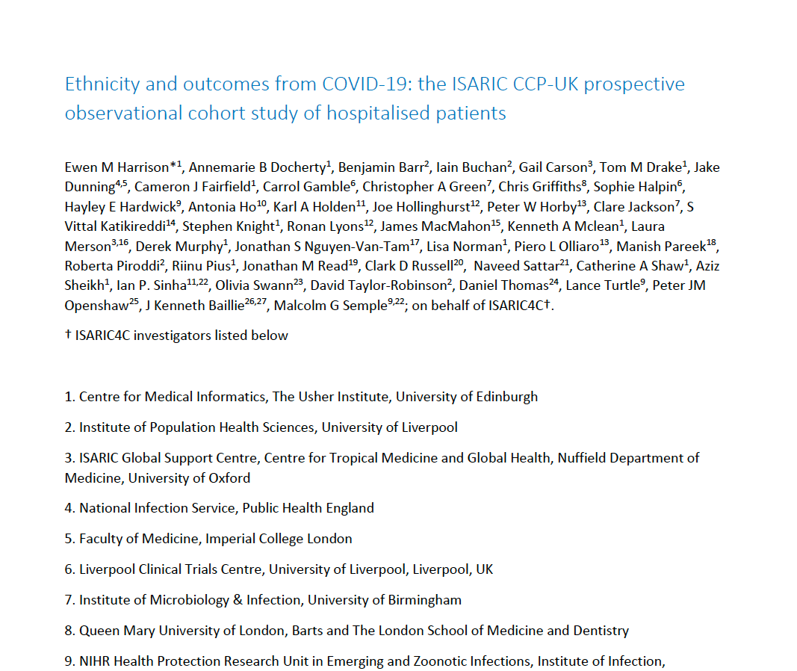
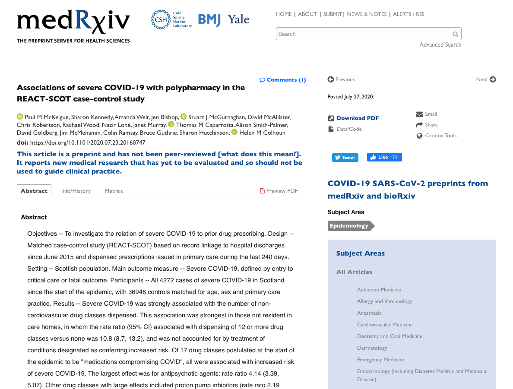
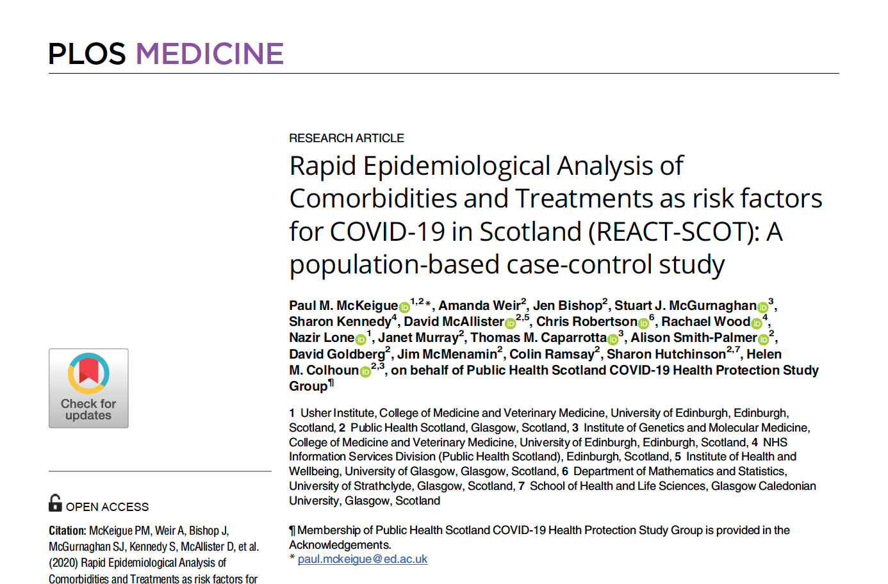
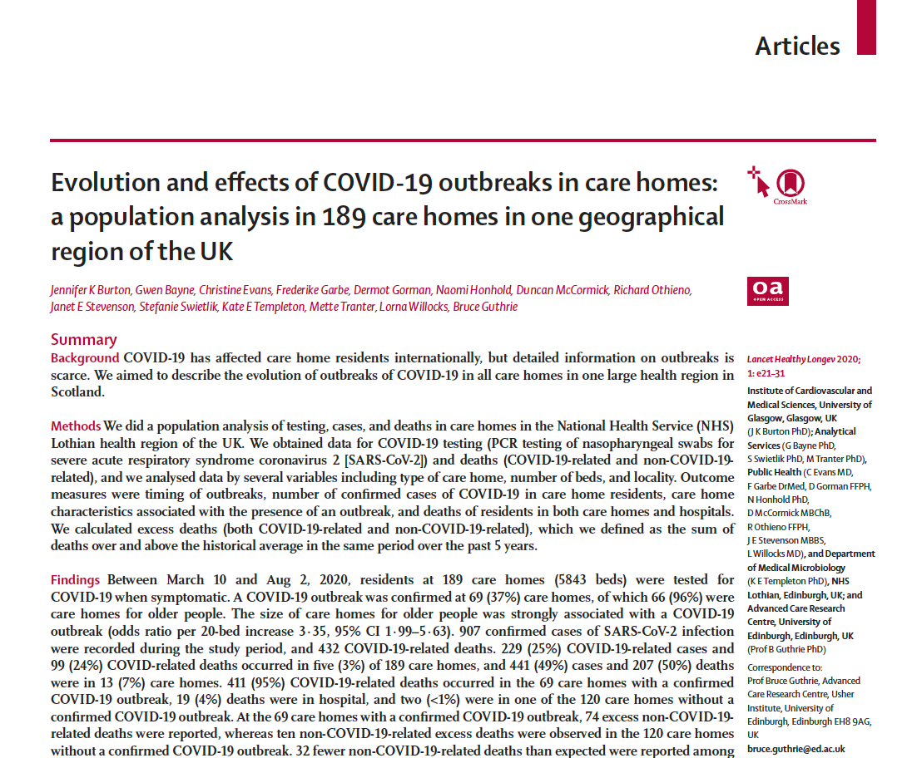
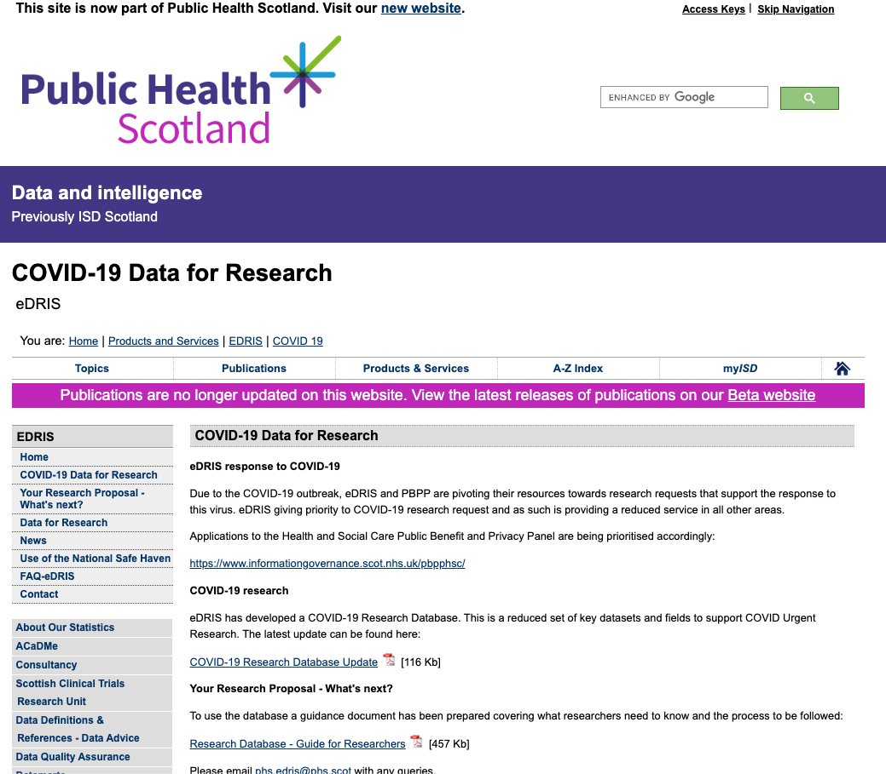

```{r setup, include=FALSE}
options(htmltools.dir.version = FALSE)
```

## Background

Almost half of all deaths attributable to COVID-19 in Scotland (and the wider UK) occurred in Care Homes. Despite this, most published research has focussed on the non-Care Home population. 

There are a couple of **possible** reasons for this.

1. Care Home residents can be difficult to identify in routine datasets

1. The immediate research research response was focussed on those most likely to benefit from treatment.

---

## Background

.pull-left[
### Example 1


]

--
.pull-right[
### Example 2


]

---
## Background

.pull-left[
### Example 3


]

--
.pull-right[
### Example 4


]

---

## Background

### Example 5



---

## Background

### Motivating factors (recap)

<br/>
* **Most studies using Scottish data have concentrated on the *non*-care home population**

<br/>

* **Where care homes *have* been the focus:** 

 1. **the CHI flag has been used for identification- this is not entirely accurate**
 1. **analyses omit care home residents from important findings**
 1. **analyses may not be at the individual level**
 1. **important covariates (such as morbidity data from PC) are missing**

---

## Methods

### Aim

**To characterise the sociodemographic and health features of those over the age of 65 that have been identified as contracting COVID-19 and their associations with mortality**

<br/>

Main study period runs from 1st March - 30th June 2020

<br/>
Utilises the new COVID-19 Research Dataset and expedited approvals process

---
# Methods

### COVID-19 research data



---

## Methods

### Data Sources

.pull-left[
* CHI
  - Demographics
  - CHI Care Home Flag
  - UPRN (not yet available)
* NRS Deaths
* UCD deaths
* ECOSS
* PIS
* Primary Care (not yet available)
]

.pull-right[
* Diabetes
* SICSAG
* Unscheduled Care (using CUP IDs)
 - SMR01
 - A & E
 - GP OOH
 - SAS
 - NHS24]


---
## Results

* Not yet unfortunately...

<br/>

* But we hope to have meaningful findings soon

<br/>

* Chance to understand the vulnerable care home population in more depth than we have seen previously

<br/>

* First look at how UPRN matches against CHI flag for care home residents


---
## Acknowledgments

.pull-left[
* Co-authors
 - Dr Jenni Burton
 - Dr Elizabeth Lemmon
 - Dr Iain Atherton
 - Dr Jan Savinc
 - Prof Susan Shenkin
 - Prof David Bell
]

.pull-right[
* Support
  - Prof Chris Dibben, Tracey Dart and all at SCADR
  - eDRIS team (especially Suhail Iqbal and Dr Julian Augley)
  - PBPP panel members
]

---

class: center, middle

## Thanks!

### Any questions?

Slides created via the R package [**xaringan**](https://github.com/yihui/xaringan) 

Twitter: @_davidhen

